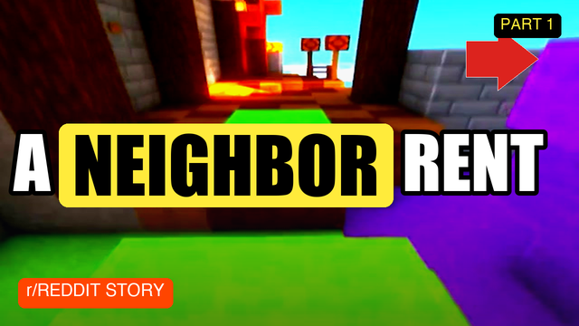
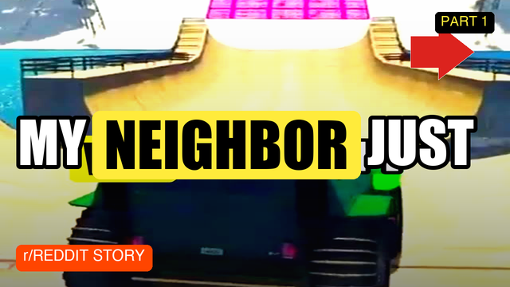

# RedditReels

[](https://github.com/vijaxx/redditreels/actions/workflows/ci.yml)

[](LICENSE)

An unattended pipeline that finds a story, rewrites it as short-form narration, renders it as a captioned vertical video, and publishes it across YouTube, Facebook, and Rumble — then watches how each upload performs and feeds that back into what it does next.

Runs on a schedule with no human step in the loop: source discovery, script rewriting, voiceover, rendering, upload, and post-publish analysis are each their own module, chained by `redditreels.py`.

## Sample output

<table><tr>
<td></td>
<td></td>
</tr></table>

<sub>Frame grabs from actual rendered output — burned-in captions, background footage, and the platform card are all generated by <code>pipeline/render.py</code>, not mocked up.</sub>

## Pipeline

```
fetch_story    → pulls a top weekly post from a curated set of subreddits (Reddit's public RSS,
                 no API key needed), dedups against everything already used
rewrite_story  → an LLM rewrites it into a 45-second hook-first narration + title
                 (provider-agnostic — see llm.py)
voice_gen      → edge-tts renders the narration to audio with per-word timing data
render         → composites a vertical (1080x1920) video: gameplay background,
                 karaoke-style animated captions synced to the word timings
upload         → publishes to YouTube (custom upload flow), and optionally
                 Facebook / Rumble
```

`llm.py` is a small compatibility shim: the rest of the codebase calls an Anthropic-shaped `client.messages.create(...)` interface, and this module routes that call to whichever provider has a configured key (Gemini, Groq, or Anthropic directly), so the pipeline keeps running on a free-tier provider without touching call sites elsewhere in the code.

## Platforms (`platforms/`)

- **`facebook_api.py`** — posts through the official Graph API where a Page access token is available (survives UI redesigns that break scrapers).
- **`facebook_chrome.py`**, **`instagram_chrome.py`**, **`rumble_chrome.py`**, **`tiktok_chrome.py`** — Chrome DevTools Protocol automation for platforms without a workable API for this use case. Each reverse-engineers the target site's upload/composer flow against a persistent, already-authenticated Chrome profile.

## Tools (`tools/`)

Everything downstream of "the video is live." A sample of what's in there:

- **Measurement**: `view_scrapers.py`, `insights_loader.py`, `view_velocity.py`, `best_time_analyzer.py` — since not every platform exposes clean view data, this reconciles what's actually measurable per platform into one comparable signal.
- **Learning loop**: `weekly_learn.py`, `performance_scorer.py`, `subreddit_winrate.py`, `title_ab_test.py`, `hashtag_effectiveness.py` — turn last week's performance into next week's source/title/hashtag choices.
- **Safety**: `self_heal.py`, `preupload_sanity.py`, `auto_disable_on_streak.py` — catch a broken render or a bad upload before it repeats, and pause the pipeline automatically after a failure streak instead of publishing garbage on a schedule.
- **Growth**: `hashtag_miner.py`, `hashtag_rotator.py`, `smart_bait.py`, `niche_first_comment.py`, `auto_reply_comments.py`, `sub_milestone.py`, `community_post.py`, `yt_playlist_curator.py`.
- **`dashboard.py`** / **`dash.py`** — a terminal snapshot of the last N runs, view counts, and current pipeline health.

## Stack

Python, edge-tts (voiceover), ffmpeg via subprocess (video compositing), Reddit RSS (source discovery, no API key required), Chrome DevTools Protocol over websockets (platform posting where no API exists), YouTube Data API, Facebook Graph API.

## Running it

```
pip install -r requirements.txt         # also needs ffmpeg on PATH for rendering
python3 redditreels.py --dry-run        # render only, skip upload
python3 redditreels.py                  # full run: fetch, rewrite, voice, render, upload
python3 redditreels.py --no-facebook --no-rumble   # YouTube only
./ensure_chrome.sh                      # bring up the Chrome profile the platform automation needs
```

Copy `config/credentials.example.json` to `config/credentials.json` and fill in your own keys — nothing under `config/` other than the example template is tracked in this repo.
